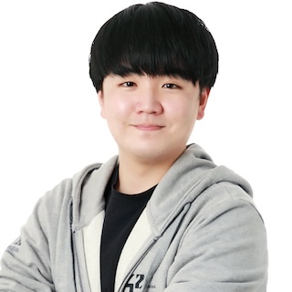

# Jaeyoung Choi (jchoi)
## Profile Pic:

## Call me by this name: Jay Choi
I used to be called ‘jchoi’ (my intra ID in the 42 network), which naturally led me to go by the English name ‘Jay’. 😄
## Cohort: July 2025
## Email ID: probablecode@gmail.com
## LinkedIn: [Jay Choi](https://www.linkedin.com/in/jay-choi-oxcart)

## Slack ID: Jay Choi
## GitHub ID: [ochsenkarren](https://github.com/ochsenkarren)
## About me:
- I hold a Bachelor's degree in Computer Science and am an alumnus of 42seoul, where I completed common core of 42 Cursus.
- Currently, I work as a mathematics lecturer and private tutor, teaching high school students and adult learners in South Korea.
## Project Links:
- I will be joining you in mid-August. Until then, I look forward to meeting you all!